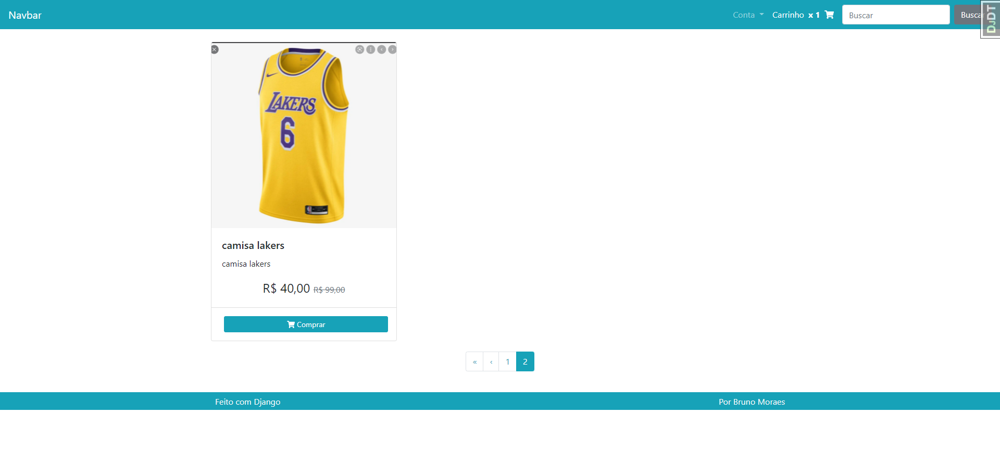
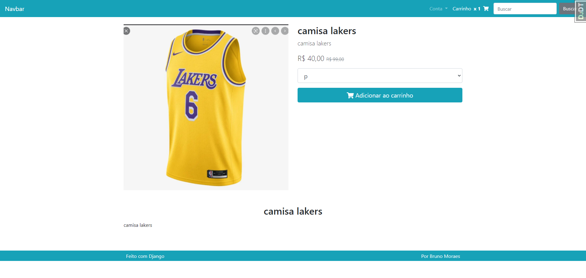
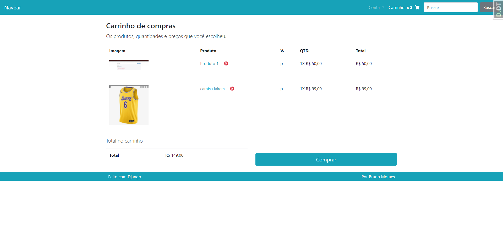
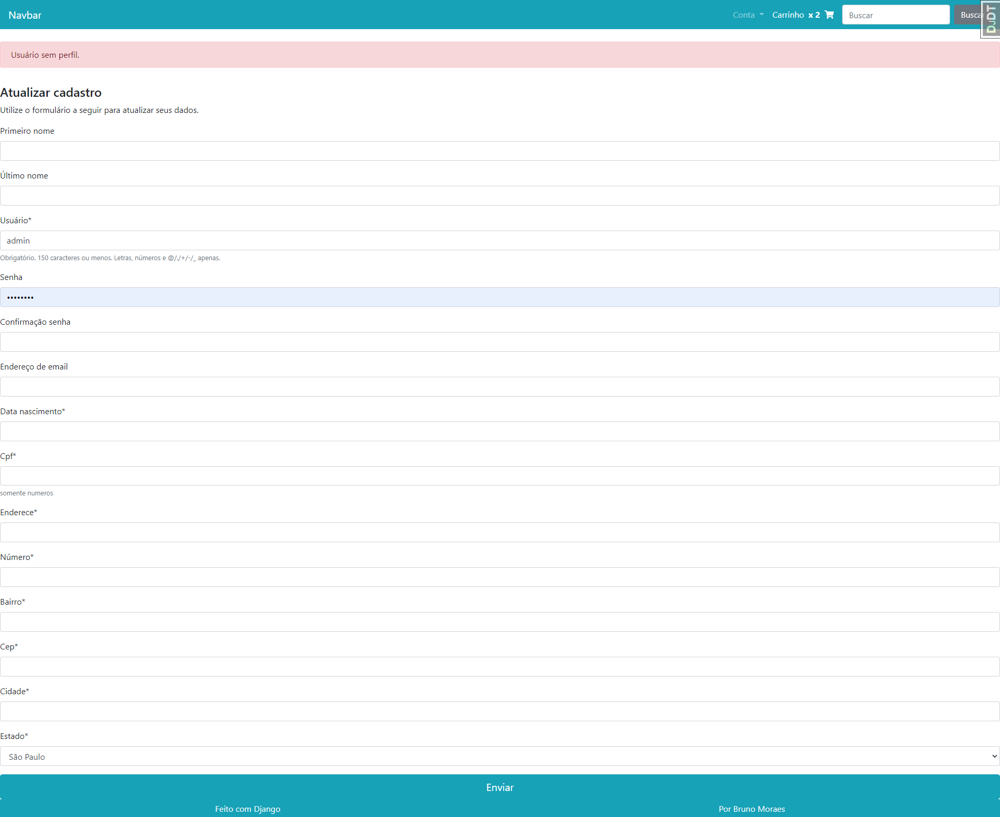

"# django_ecommerce" 
**# Resumo e descrição do projeto**
Projeto desenvolvido no curso da Udemy Construa um E-Commerce com Python 3 e Django - https://www.udemy.com/course/construa-um-e-commerce-com-python-3-e-django/

**# Assets**

 

| 
| :---: | :---: |

| 
| :---: | :---: |

